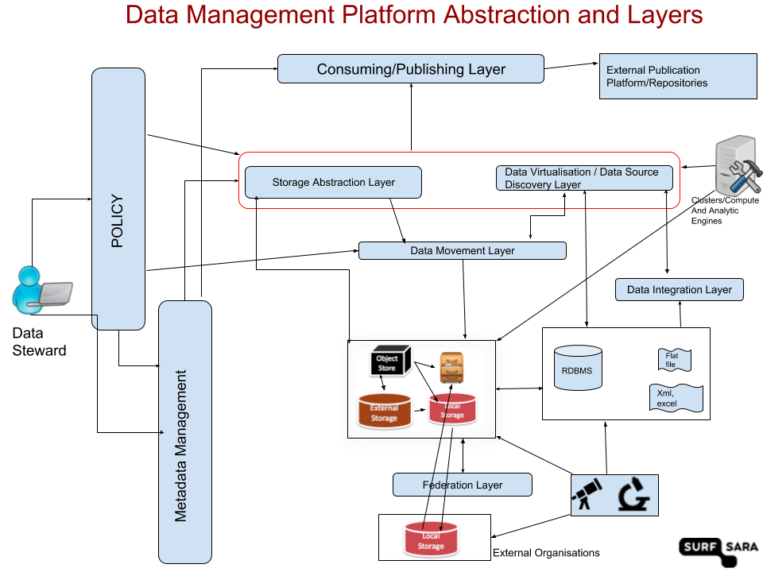

### Data Management platform features and evaluation criterion

Author: Sharif Islam 
 
System Expert 
 
Data Services Unit,  
[SURFsara](https://www.surfsara.nl) (provides services in the field of supercomputers, networks, data storage and high-quality visualization) 

*Work in Progress 

The goal of this project is to evaluate various tools and software that can play a role in data management platform solution(s). The primary community that we support is the Dutch research and educational institutes so some of these ideas came forth based on specific use cases we encountered. We hope to make this document fit for a wider audience. Our goal is to think about both general and specific use cases and then try to highlight the components and strengths of each tool. Each use case and research data management need are unique and requires various customizations. So a comprehensive data management platform will include a variety of solutions and customizations. 

#### Background and motivation 

Data Management or Research Data Management (RDM) in particular is a broad term that encapsulates activities and tools that are responsible for planning and executing actions on digital data before, during, and after a research project ([1](https://www.dtls.nl/fair-data/research-data-management/research-data-management/)). We refer to these different stages as research data life cycle and in each stages there are variety of different challenges for data management. There are also different terms and concepts employed often times for same sets of activities. Keeping these introduction in mind we came up with a set of features that support the various stages. Combining these features and tools thus often times result in a different data management solutions. 

In the commercial/non-academic business world, "Data Warehouse" and "Data Lake" are two prominent terms. Some of the tools we evaluated came from that world. We are interested in the functionalities that fit our requirements and use cases regardless of the term. 

#### Data Management Abstraction and Layers

* Storage Abstration Layer
* Data Virtualisation / Data Source Discovery Layer
* Data Movement Layer
* Fedreation Layer
* Consuming/Publishing Layer
* Policy
* Metadata

This project contains: 

1. Feature list
2. [software/product list](https://github.com/sara-nl/dmp_feature_matrix/blob/master/software.md)
3. Detail test results/product review (if exists and possible) 

Reference 
1. https://www.dtls.nl/fair-data/research-data-management/research-data-management/
